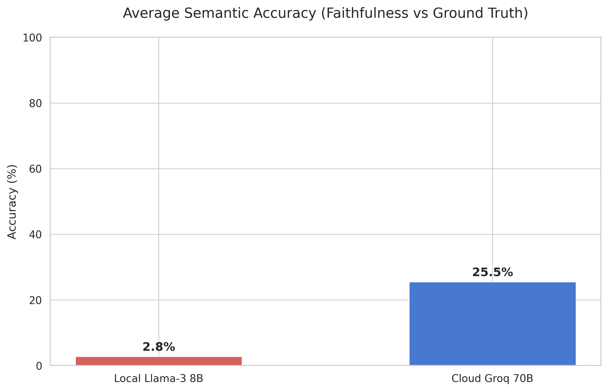
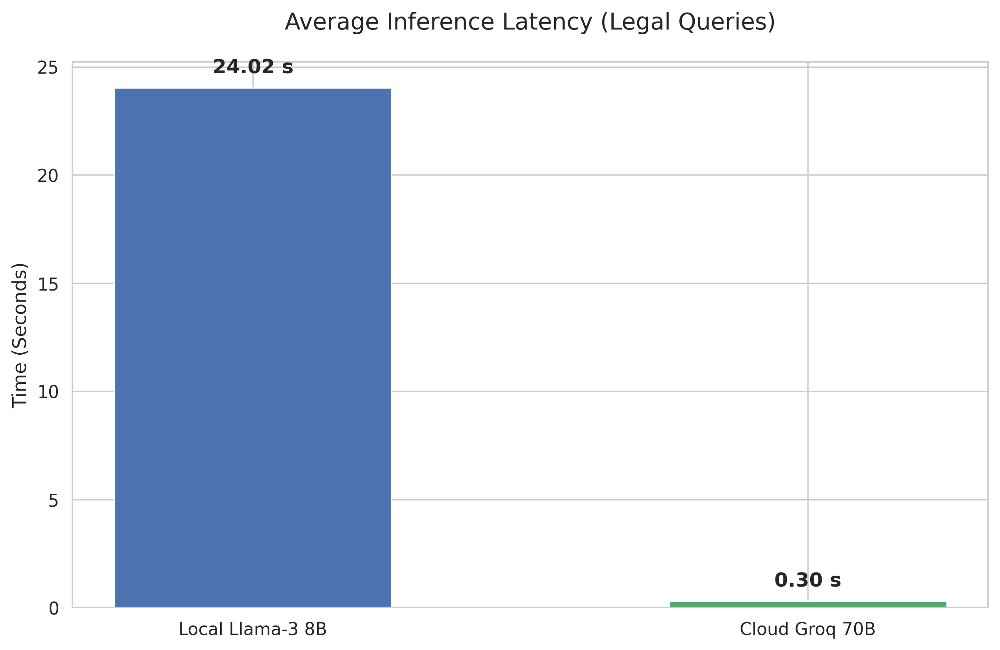
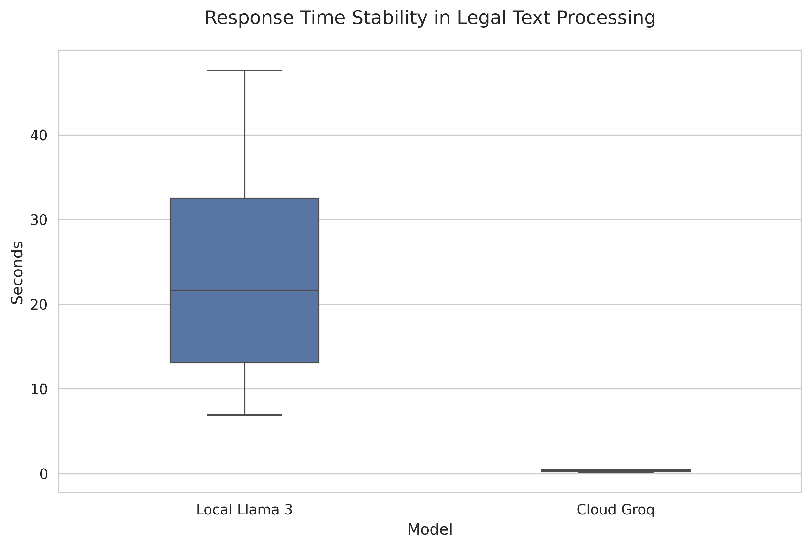
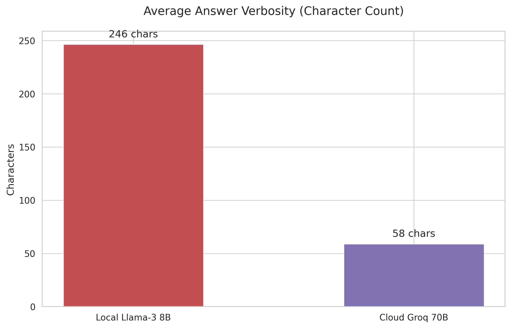

# ⚖️ Smart Legal Advisor - RAG Benchmarking on Syrian Legislation

## 📌 Overview
The **Smart Legal Advisor** is an advanced Retrieval-Augmented Generation (RAG) system built to navigate and extract precise answers from Syrian legislation. Beyond just providing a functional application, this project serves as a comprehensive **benchmarking study**, evaluating the trade-offs between local and cloud-based Large Language Models (LLMs) in a strict legal context where hallucination is unacceptable.

## ✨ Key Features & Technical Highlights
*   **Dual-Engine Architecture:** Users can switch between a highly secure local model (`Llama-3-8B-Instruct` quantized to 4-bit) and a high-performance cloud model (`Groq Llama-3.3-70b-versatile`).
*   **Multilingual Semantic Embedding:** Utilizes `sentence-transformers/paraphrase-multilingual-mpnet-base-v2` to process and retrieve complex Arabic legal texts efficiently via ChromaDB.
*   **Dynamic Document Injection:** Allows users to dynamically upload new legal documents (PDF/Word) and immediately inject them into the vector database for extended semantic search.
*   **Comprehensive RAG Evaluation:** Includes a full benchmarking suite measuring Inference Latency, Response Time Stability, Verbosity, and Semantic Accuracy (Faithfulness vs. Ground Truth).

## 📊 Benchmarking Results
The system was rigorously evaluated across 15 complex legal queries. The results highlight significant differences between the deployment environments:

### 1. Semantic Accuracy (Faithfulness)
The cloud-based `Groq 70B` significantly outperformed the `Local Llama-3 8B`, demonstrating a higher semantic fidelity to the legal ground truth.


### 2. Inference Latency & Time Stability
`Groq` provided incredibly fast and stable responses (averaging 0.30s), while the local implementation required significantly more processing time (averaging 24.02s) with higher variance.



### 3. Answer Verbosity
The `Local Llama-3 8B` tended to generate more verbose answers (averaging 246 characters), whereas the `Groq` model adhered strictly to the prompt instructions for concise answers (averaging 58 characters).


## 🛠️ Tech Stack
*   **Frameworks:** LangChain, Streamlit
*   **LLMs:** Meta Llama-3 8B (HuggingFace Pipeline), Llama-3.3-70b (via Groq API)
*   **Embeddings & NLP:** SentenceTransformers (`paraphrase-multilingual-mpnet-base-v2`), PyMuPDF (`fitz`), `pdfplumber`
*   **Vector Database:** ChromaDB
*   **Data Processing:** Pandas, Regex (Arabic normalization)

## 🚀 Installation & Setup

1. **Clone the repository:**
   ```bash
   git clone https://github.com/YourUsername/smart-legal-advisor.git
   cd smart-legal-advisor


Create and activate a virtual environment:

python -m venv venv
source venv/bin/activate  # On Windows use: venv\Scripts\activate


Install dependencies:

pip install -r requirements.txt


Environment Variables:
Ensure you set your API keys as environment variables (or modify the app.py script directly if running locally for testing):

HF_TOKEN (Hugging Face)

GROQ_API_KEY (Groq)

Run the Data Processor (Optional):
If you need to process raw PDF laws, place them in a raw_laws folder and run:

python data_processor.py


Run the Streamlit App:
Note: Ensure the ChromaDB is built or available in the specified path.

streamlit run app.py


📈 Evaluation Dataset

The benchmarking results are available in the data/ folder:

RAG_Laws_Results.csv (Raw generated answers and latency times)

RAG_Laws_Results_Scored.csv (Computed semantic similarity scores)
